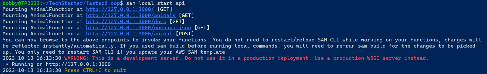
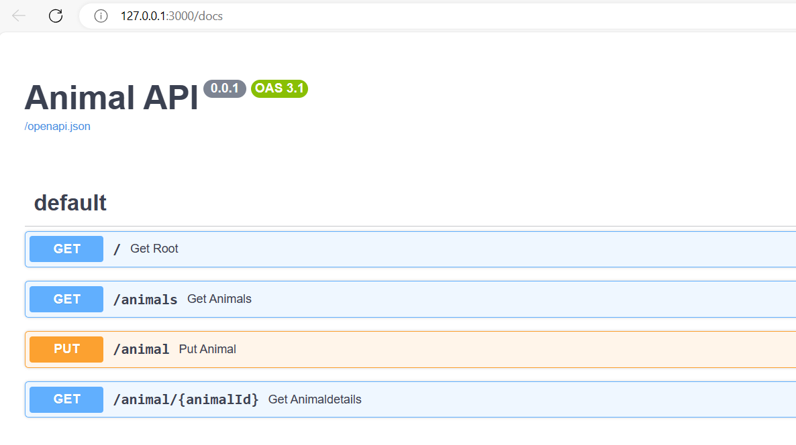

# Requirements
- docker <https://learn.microsoft.com/en-us/windows/wsl/tutorials/wsl-containers>
- aws sam  <https://aws.amazon.com/de/serverless/sam/>

# Container bauen

```
sam build --use-container
```

# Testen

```
sam local start-api
```



# Ergebnis


